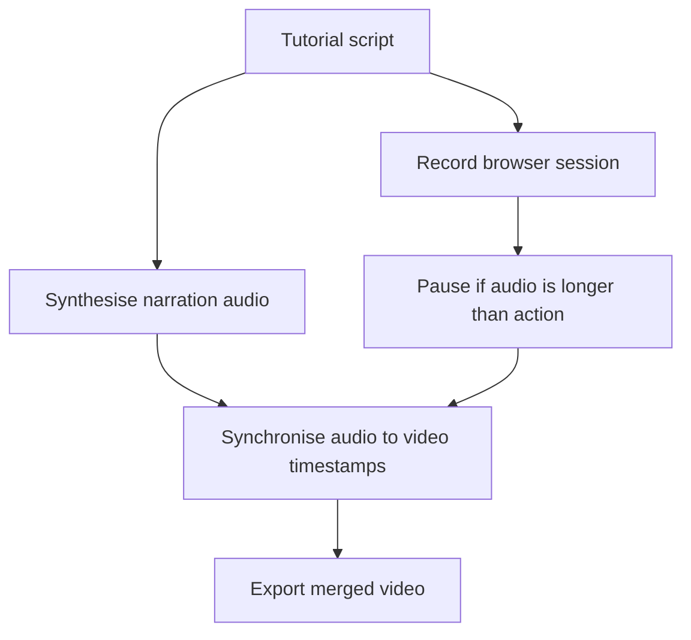

# Playwright Tutorial Generator

Automate narrated screen-recording tutorials from Python scripts.

- Browser interactions with [Playwright](https://playwright.dev/)
- Narration by [Piper TTS](https://github.com/rhasspy/piper)

> [!NOTE]
> This is **not a package**. It is a working example to show that the approach is viable.
> Copy, adapt, and build on it as you see fit.

---

## How it works



### Step by step

1. **Author** — write a `tutorials/*.py` script using `SectionList`. Each section is a decorator pairing a Playwright page-action function with its narration text.
2. **Audio** — `generate_audio` calls Piper TTS to synthesise each narration string into an MP3 file.
3. **Video** — `generate_video` launches a headless Chromium browser, runs each section function, and records the wall-clock timestamp at the end of each.
4. **Sync** — `synchronize_video_audio` uses MoviePy to attach each section narration as starting at the corresponding timestamp.
5. **Output** — the merged video is saved as `.webm`.

---

## Setup

    make

This runs three targets in order:

| Target | What it does |
|---|---|
| `make envs` | Creates the Python virtualenv and installs Python dependencies; installs Node dependencies via pnpm |
| `make voices` | Downloads the `en_US-amy-medium` Piper TTS voice model into `./voices/` |
| `make browsers` | Installs Playwright's Chromium browser binary |

### Run

Start the demo web application (required for the browser to have something to record):

```bash
make start-web-server
```

In a second terminal, run the tutorial recording script:

```bash
make start-playwright-record
```

The output video is written to `tmp_videos/localhost_recording_merged.webm`.

## Codegen

`make start-playwright-codegen` Opens Playwright's interactive code generator pointed at `localhost:5173` — useful for authoring new section actions

## Tech stack

### Python service (`services/video_service`)

| Library | Purpose |
|---|---|
| [Playwright](https://playwright.dev/python/) | Headless browser automation and video recording |
| [Piper TTS](https://github.com/rhasspy/piper) | Offline neural text-to-speech, runs locally |
| [MoviePy](https://zulko.github.io/moviepy/) | Video/audio composition — attaches narration to the recorded video |
| [pydub](https://github.com/jiaaro/pydub) | Converts raw WAV audio buffers from Piper into MP3 |

### Svelte service (`services/web_application`)

| Library | Purpose |
|---|---|
| [SvelteKit 5](https://svelte.dev/) | App framework — the demo web application being recorded |
| [TailwindCSS 4](https://tailwindcss.com/) | Utility-first CSS |
| [shadcn-svelte](https://shadcn-svelte.com) | Styled components for svelte |

---

## References

- [Playwright `slow_mo` option](https://playwright.dev/docs/api/class-browsertype#browser-type-launch-option-slow-mo)
- [Playwright video recording](https://playwright.dev/docs/videos)
- [Piper TTS voice models](https://github.com/rhasspy/piper/blob/master/VOICES.md)
